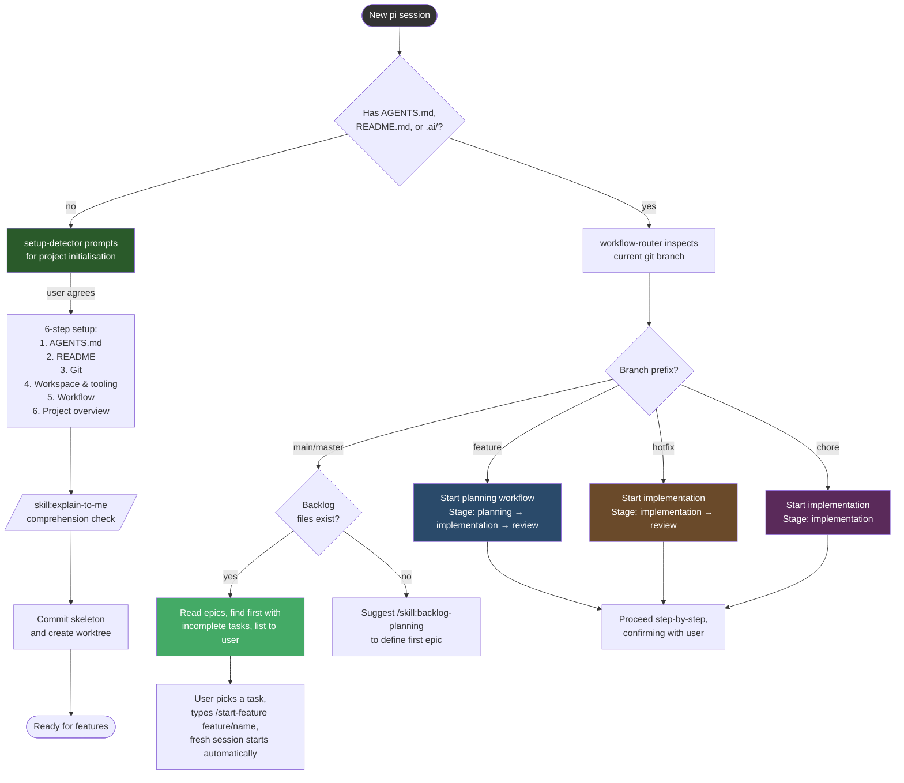

# @bjconlan/pi-base

Personal pi preferences and configuration package.

## Contents

| Resource | Source | Description |
|----------|--------|-------------|
| **Extension** | `extensions/setup-detector.ts` | Detects fresh projects (no AGENTS.md, README, or .ai/) and prompts to run through initialisation on new session. |
| **Extension** | `extensions/workflow-router.ts` | On new sessions, detects the git branch and auto-starts the appropriate workflow (planning for feature, implementation for hotfix and chore). |
| **Extension** | `extensions/file-hash-guard.ts` | Guards write/edit calls — warns if a file changed externally since the agent last read it, and asks for confirmation before overwriting. |
| **Extension** | `extensions/response-style.ts` | Automatically injects response style guidelines, co-author convention, and coding style preferences into every session's system prompt. |
| **Extension** | `extensions/oauth-resolver.ts` | Resolves OAuth/bearer tokens for external service APIs (X, Spotify) via env vars or user prompt. Used by assimilate-knowledge skill. |
| **Skill** | `skills/backlog-planning/SKILL.md` | Agile epic/feature/task management with indexed backlog files in `.ai/backlog/`. |
| **Skill** | `skills/explain-to-me/SKILL.md` | Comprehension check — the agent describes back what it understood before building on foundational information. |
| **Skill** | `skills/educate-me/SKILL.md` | Teaches code from first principles, saves tutorials to `.ai/knowledge/references/`. |
| **Skill** | `skills/assimilate-knowledge/SKILL.md` | Researches topics across YouTube, Reddit, BlueSky, articles, and podcasts. Saves findings to `.ai/knowledge/references/`. |
| **Template** | `templates/branch-workflow.md` | Stage composition reference for branch-based workflows. |
| **Template** | `templates/stages/planning.md` | Planning stage: interview, architecture, plan writing, review, prototype. |
| **Template** | `templates/stages/implementation.md` | Implementation stage: impact analysis, code, tests, benchmarks. |
| **Template** | `templates/stages/review.md` | Review stage: outcomes, final verification, user review, merge, cleanup. |
| **Template** | `templates/AGENTS.md` | Project-level agent config template (lifecycle, knowledge architecture, working rules, guardrails). |

## Installation

```bash
pi install /home/bjc/Workspace/pi-base
```

```bash
pi install .
```

### First-time setup

If you previously had `~/.pi/agent/APPEND_SYSTEM.md` with the response style guidelines, remove it after installing — `response-style.ts` handles it automatically and having both duplicates the guidelines:

```bash
rm ~/.pi/agent/APPEND_SYSTEM.md
```

Then run `/reload` in pi.

## Startup Behaviour



## Session Storage

Session logs are stored per-worktree in `.ai/history/`. Each `git worktree add` creates a separate directory with its own history, giving natural per-branch session isolation.

## Commands

| Command | When to use |
|---------|-------------|
| `/start-feature <name>` | After picking a task from the backlog, type this to create the branch and start a fresh session. E.g. `/start-feature feature/add-auth` |

## Skills

| Skill | When to use |
|-------|-------------|
| `/skill:backlog-planning` | Define epics, features, and tasks. Run when starting a new project phase or when the roadmap needs clarification. |
| `/skill:explain-to-me` | Ask the agent to describe back what it understood before it builds on foundational information. |
| `/skill:educate-me` | Learn how and why code works, from first principles. Saves tutorials to `.ai/knowledge/references/`. |
| `/skill:assimilate-knowledge` | Research a topic across multiple sources (YouTube, Reddit, BlueSky, articles) for up-to-date information. |

The response style guidelines are active automatically in every session — no action needed.

## Future support and refinement

To support fossilscm or other scms in generall we need to adapt this away from explicity using git and generalise the git flow style workflow which is currently used.

We need to identify a good way for sub agents to perform tasks. (perhaps worktree per sub-agent against main and they take tasks off the top of the list and perform prs in their created branches?)

Secondary agent verification doesn't seem to be triggered or even asked for. This needs to be investigated.