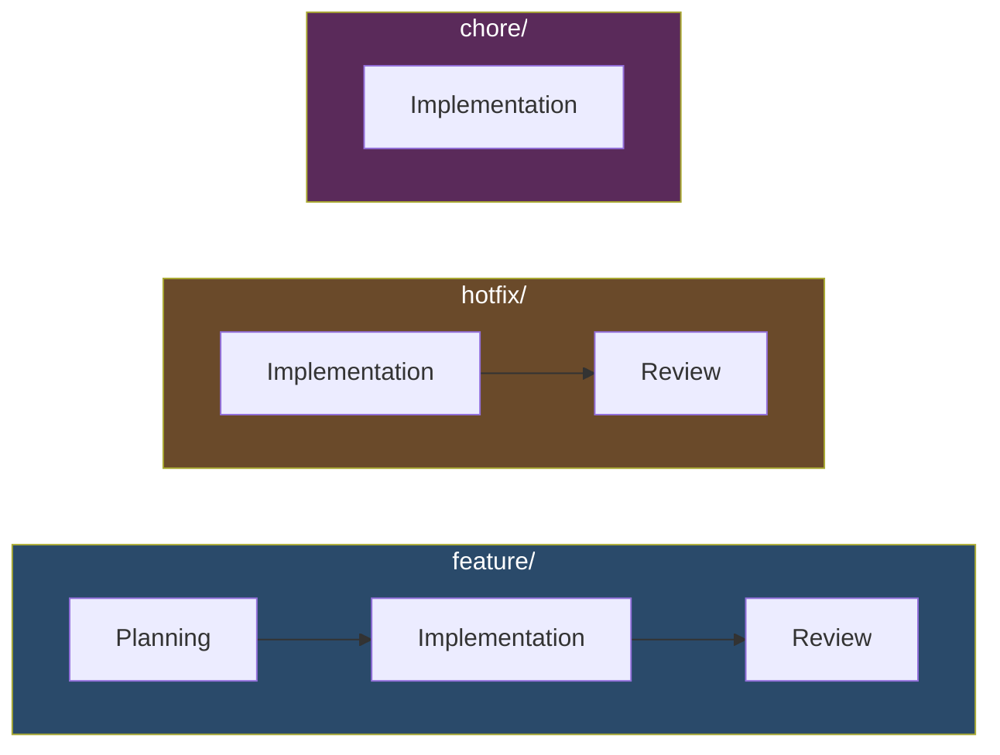

# Branch Workflow Reference

This document defines the stages available and how they compose per branch type.

## Stage Composition

| Stage | Description |
|-------|-------------|
| [Planning](stages/planning.md) | Interview, architecture design, plan writing, review, prototype |
| [Implementation](stages/implementation.md) | Impact analysis, code, tests, benchmarks |
| [Review](stages/review.md) | Outcomes, final verify, user review, merge, cleanup |

Users can define additional branch types per project in `AGENTS.md`.

## Cross-cutting conventions

These apply to all stages:

- **Read from disk** — at each stage boundary, read `.ai/feature/<name>.md` and `.ai/knowledge/` from disk rather than relying on conversation history
- **Mermaid diagrams** — all diagrams in Mermaid format
- **Document change convention** — append-only with strikethrough and HTML comment metadata
